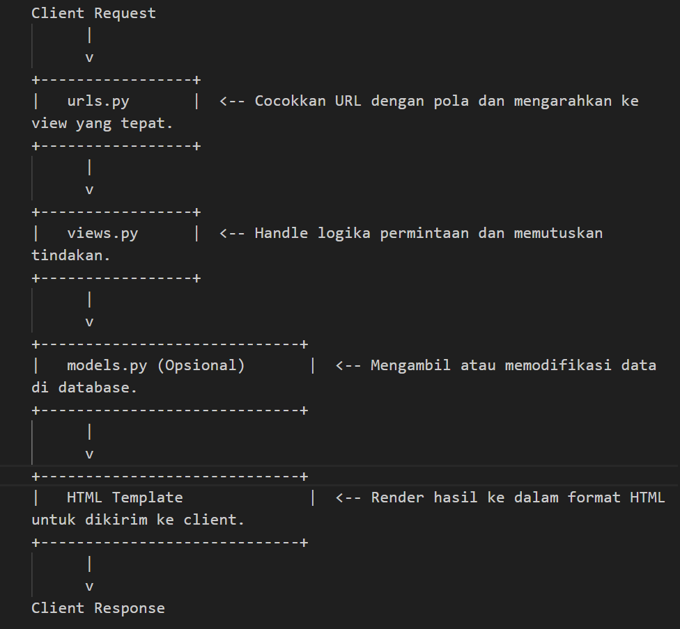
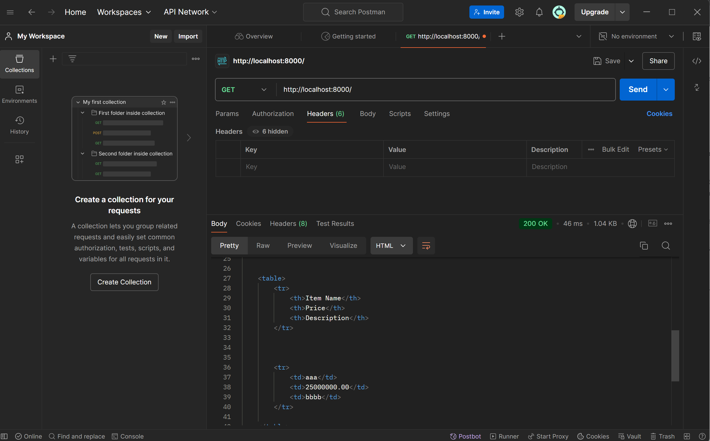
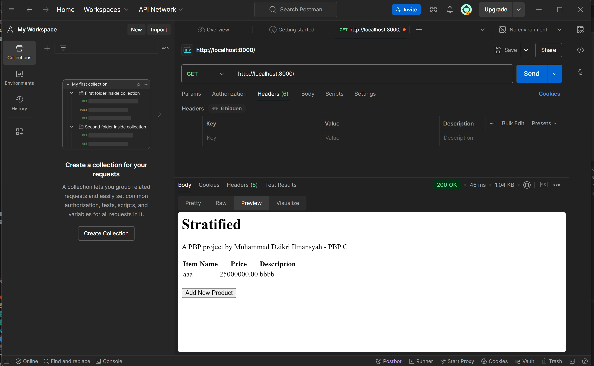

# Tugas 1

1. step 1 : membuat project django baru dilakukan dengan membuat direktori lokal dan mengaktifkan virtual environment
   step 2 : menjalankan python manage.py startapp main pada direktori utama untuk membuat app main
   step 3 : membuat file urls.py di main untuk mengatur routing URL di app main. Untuk routing proyek, tambahkan path('', include('main.urls')) di urls.py direktori utama bagian urlpatterns
   step 4 : mengisi models.py pada app main dengan class Product. Saya membuat 4 atribut yaitu name, price, description, dan image
   step 5 : mengisi views,py dengan data yang diinginkan sesuai model yang sudah dibuat. Kemudian membuat template html untuk isi konten app.
   step 6 : menambahkan  path('', show_product, name='show_product') di urls.py app main untuk mapping fungsi yang sudah dibuat di views.py
   step 7 : melakukan makemigration, migrate, kemudian git add, commit, push pws main:master
2. Berikut merupakan diagram request client ke platform django
      

3. 
      - Mengelola versi kode: Melacak setiap perubahan kode, agar masih bisa kembali ke versi sebelumnya.
      - Kolaborasi tim: Memungkinkan banyak pengembang bekerja secara bersamaan tanpa bentrok.
      - Branching: Bekerja pada fitur terpisah tanpa mempengaruhi kode utama.
      - Merging: Menggabungkan cabang terpisah kembali ke proyek utama.
      - Conflict handling: Menangani konflik saat dua orang mengubah bagian kode yang sama.
      - History: Menyimpan semua perubahan yang pernah dibuat.
      - Distribusi: Memungkinkan pekerjaan offline dengan salinan lengkap proyek.
      - Backup otomatis: Setiap salinan berfungsi sebagai cadangan proyek.

4. 
      - Menyediakan banyak fitur bawaan (seperti otentikasi, routing, ORM) yang mengurangi kebutuhan untuk memasang banyak library eksternal sehingga bisa langsung fokus pada logika
      aplikasi tanpa khawatir soal hal-hal teknis dasar.
      - Menerapkan arsitektur Model-View-Template (MVT) sehingga memudahkan pemahaman alur aplikasi dan pengembangan software yang terorganisir.

5. Model pada Django disebut ORM (Object-Relational Mapping) karena menghubungkan objek Python dengan tabel di database. Dengan ORM, developer bisa bekerja dengan data di database seperti bekerja dengan objek Python, tanpa perlu SQL sebagai database.

# Tugas 2

1. 
      - Optimalisasi Interaksi Antara Klien dan Server: Platform membutuhkan mekanisme yang efisien untuk pertukaran data antara klien (seperti browser atau aplikasi) dan server. Proses ini melibatkan pengiriman permintaan HTTP dan penerimaan respons HTTP, yang harus dijalankan dengan cepat dan tepat untuk mengurangi waktu tunggu dan meningkatkan kepuasan pengguna.

      - Pengelolaan Respons HTTP yang Efektif: Terdapat berbagai metode permintaan HTTP seperti GET, POST, PUT, PATCH, dan DELETE memainkan peran penting dalam CRUD (Create, Read, Update, Delete) operasi pada data. Platform perlu mengelola respons ini secara efisien untuk menjamin data yang diakses adalah akurat dan terkini, yang sangat penting dalam operasi seperti update konten dinamis atau transaksi e-commerce.

      - Penggunaan AJAX dan JSON untuk Komunikasi Asinkron: AJAX (Asynchronous JavaScript and XML) dan JSON (JavaScript Object Notation) memungkinkan penggunaan data secara asinkron, yang berarti pengguna dapat terus berinteraksi dengan halaman web sementara data lain sedang dimuat sehingga membantu meningkatkan responsivitas dan kecepatan platform, memungkinkan pengguna merasakan pengalaman yang lebih mulus tanpa harus menunggu halaman dimuat sepenuhnya.

2. 
      - Lebih Ringkas: JSON memiliki format yang lebih sederhana dan ukuran file yang lebih kecil dibandingkan XML.
      - Lebih Cepat: JSON lebih cepat diproses karena lebih ringan dan mudah di-parse oleh bahasa pemrograman seperti JavaScript.
      - Kompatibilitas: JSON secara alami kompatibel dengan banyak bahasa pemrograman modern, khususnya JavaScript.
      - Mudah Dibaca: JSON lebih mudah dibaca oleh manusia dan mesin karena sintaks yang sederhana.
      - Populer di API Modern: JSON lebih umum digunakan dalam AJAX dan RESTful APIs karena kecepatan dan efisiensinya.

3. Dalam Django, method is_valid() digunakan pada form untuk memeriksa apakah data yang diinput oleh pengguna sesuai dengan aturan validasi yang telah didefinisikan di dalam form tersebut. Fungsi ini sangat penting untuk memastikan bahwa hanya data yang valid yang akan diproses lebih lanjut, seperti disimpan dalam database.

      ```
      form = ProductEntryForm(request.POST or None)

      if form.is_valid() and request.method == "POST":
      form.save()  # Data valid disimpan ke database
      return redirect('main:show_main')
      ```

4. csrf_token dibutuhkan di Django untuk melindungi aplikasi dari serangan Cross-Site Request Forgery (CSRF). Token ini memastikan bahwa permintaan yang dikirim berasal dari sumber yang sah dan mencegah penyerang mengirim permintaan palsu atas nama pengguna.

      Tanpa csrf_token, aplikasi menjadi rentan terhadap serangan CSRF, di mana penyerang dapat memanfaatkan session pengguna yang valid untuk melakukan tindakan berbahaya seperti perubahan data atau transaksi tanpa sepengetahuan pengguna.

5. 
      - buat forms.py untuk input data:
            
            from django.forms import ModelForm
            from main.models import Product

            class ProductEntryForm(ModelForm):
            class Meta:
                  model = Product
                  fields = ["name", "price", "description"]
        
      - update views.py untuk form:
            
            from django.shortcuts import render, redirect
            from .forms import ProductEntryForm

            def create_product_entry(request):
            form = ProductEntryForm(request.POST or None)
            if form.is_valid() and request.method == 'POST':
                  form.save()
                  return redirect('main:show_main')
            return render(request, 'create_product_entry.html', {'form': form})

      - buat template form di create_product_entry.html
      - buat View untuk Format XML dan JSON

            from django.http import HttpResponse
            from django.core import serializers
            from .models import Product
                        
            def show_xml(request):
            data = Product.objects.all()

            def show_xml(request):
            data = Product.objects.all()
            return HttpResponse(serializers.serialize("xml", data), content_type="application/xml")

            def show_json(request):
            data = Product.objects.all()

            def show_json(request):
            data = Product.objects.all()
            return HttpResponse(serializers.serialize("json", data), content_type="application/json")

      - update routibg url :

            from django.urls import path
            from main.views import show_main
            from main.views import show_main, create_product_entry
            from main.views import show_main, create_product_entry, show_xml
            from main.views import show_main, create_product_entry, show_xml, show_json

            app_name = 'main'

            urlpatterns = [
            path('', show_main, name='show_main'),
            path('create-product-entry', create_product_entry, name='create_product_entry'),
            path('xml/', show_xml, name='show_xml'),
            path('json/', show_json, name='show_json'),
            ]

      
      

# Tugas 4
1. 
      | **Aspek**                   | **HttpResponseRedirect()**                        | **redirect()**                              |
      |-----------------------------|----------------------------------------------------|---------------------------------------------|
      | **Definisi**                | Kelas yang mengembalikan respons HTTP redirect (302) secara langsung. | Fungsi utilitas Django untuk membuat redirect dengan lebih mudah. |
      | **Penggunaan**              | Menerima URL string sebagai argumen.              | Menerima URL string, nama view, atau objek model sebagai argumen. |
      | **Fleksibilitas**           | Kurang fleksibel, hanya bekerja dengan URL string. | Lebih fleksibel, dapat bekerja dengan nama view dan objek model. |
      | **Contoh Penggunaan**       | `HttpResponseRedirect('/target-url/')`            | `redirect('target-view-name')` atau `redirect('/target-url/')` |
      | **Keterbacaan Kode**        | Kurang intuitif untuk pemula karena membutuhkan URL eksplisit. | Lebih mudah dipahami dan digunakan dalam konteks aplikasi Django. |
      | **Kemudahan Penentuan URL** | Harus menentukan URL secara manual.               | Otomatis menangani penentuan URL jika menggunakan nama view atau model. |
      | **Internal Mechanism**      | Mengembalikan objek `HttpResponseRedirect`.       | Merupakan pembungkus yang juga mengembalikan `HttpResponseRedirect` setelah memproses URL. |

2. Untuk menghubungkan model `Product` dengan `User`, kita menggunakan *ForeignKey* pada model `Product` yang mengacu ke model `User`. Sehingga memungkinkan setiap produk terkait dengan satu pengguna, dan satu pengguna dapat memiliki banyak produk.

      ### Implementasi:

      **Definisikan Relasi di Model:**

      ```python
      from django.db import models
      from django.contrib.auth.models import User

      class Product(models.Model):
            name = models.CharField(max_length=100)
            price = models.DecimalField(max_digits=10, decimal_places=2)
            description = models.TextField()
            owner = models.ForeignKey(User, on_delete=models.CASCADE)  # Menghubungkan ke User
      ```

      **Penjelasan:**

      - **`ForeignKey`**: Menunjukkan bahwa `Product` terhubung dengan `User`.
      - **`on_delete=models.CASCADE`**: Jika pengguna dihapus, produk yang dimiliki juga dihapus.

      **Penggunaan di Views:**

      Saat membuat produk, kita bisa menetapkan `owner` sebagai pengguna yang sedang login:

      ```python
      def create_product(request):
            form = ProductEntryForm(request.POST or None)
            if form.is_valid():
            product = form.save(commit=False)
            product.owner = request.user
            product.save()
            return redirect('main:show_main')
      ```

      **Mengakses Data:**

      Kita bisa mendapatkan semua produk milik pengguna dengan:

      ```python
      user_products = request.user.product_set.all()
      ```
3.
      **Authentication**: Proses memverifikasi identitas pengguna, yaitu memastikan siapa pengguna tersebut. Contoh umumnya adalah saat pengguna memasukkan username dan password untuk login.
      
      **Authorization**: Proses memverifikasi apakah pengguna yang sudah diotentikasi memiliki izin untuk mengakses sumber daya tertentu. Ini menentukan apa yang dapat atau tidak dapat dilakukan oleh pengguna di dalam aplikasi.

      ### Apa yang Dilakukan saat Pengguna Login

      Saat pengguna login, yang terjadi adalah **authentication**—sistem memeriksa kredensial (seperti username dan password) untuk memastikan pengguna adalah siapa yang mereka klaim. Jika berhasil, pengguna diotentikasi dan session untuk pengguna tersebut dimulai.

      ### Implementasi di Django

      1. **Authentication di Django**:
      - Django menggunakan middleware otentikasi bawaan (`django.contrib.auth`) yang menyediakan fungsi login, logout, dan sistem manajemen pengguna.
      - Metode `authenticate()` memverifikasi kredensial pengguna, dan `login()` digunakan untuk memulai session pengguna.

      ```python
      from django.contrib.auth import authenticate, login

      def user_login(request):
            username = request.POST['username']
            password = request.POST['password']
            user = authenticate(request, username=username, password=password)
            if user is not None:
            login(request, user)
            # Pengguna berhasil diotentikasi
            else:
            # Autentikasi gagal
      ```

      2. **Authorization di Django**:
      - Django mengatur izin dengan menggunakan model `Permissions` dan grup yang dapat diberikan kepada pengguna.
      - Menggunakan dekorator seperti `@login_required` dan `@permission_required` untuk mengontrol akses ke fungsi atau halaman tertentu.

      ```python
      from django.contrib.auth.decorators import login_required, permission_required

      @login_required
      @permission_required('app_name.permission_name')
      def view_protected(request):
            # Hanya pengguna yang diotentikasi dan diizinkan yang dapat mengakses
      ```
4. Django mengingat pengguna login menggunakan **cookies** dan **session**. Saat login, Django menyimpan session ID di server dan mengirimkan cookie berisi session ID ke browser pengguna. Saat pengguna mengakses situs kembali, cookie ini membantu Django mengenali pengguna.

      ### Kegunaan Lain dari Cookies

      - **Menyimpan Preferensi Pengguna**: Misalnya, bahasa atau tema yang dipilih.
      - **Pelacakan dan Analitik**: Untuk memantau aktivitas pengguna di situs.
      - **Menyimpan Keranjang Belanja**: Menyimpan item dalam keranjang belanja pengguna.
      - **Iklan dan Pemasaran**: Menampilkan iklan berdasarkan perilaku pengguna.

      ### Cookies bisa beresiko jika...

      - **Berisi Data Sensitif**: Rentan terhadap eksploitasi jika tidak dienkripsi.
      - **Tidak Aman (HTTP Only)**: Bisa diakses oleh JavaScript, rentan terhadap XSS.
      - **Tidak Menggunakan Secure Flag**: Rentan disadap saat dikirim tanpa enkripsi.
      - **CSRF**: Bisa dieksploitasi dalam serangan Cross-Site Request Forgery jika tidak dilindungi dengan baik.

5. 
      ### 1. Mengimplementasikan Fungsi Registrasi, Login, dan Logout

      - **Langkah 1: Implementasi Registrasi**
      - Buat fungsi `register` di `views.py` menggunakan `UserCreationForm` untuk menangani pendaftaran pengguna baru.
      - Pada form, validasi input dan simpan data jika valid, lalu arahkan pengguna ke halaman login.

      ```python
      from django.contrib.auth.forms import UserCreationForm
      from django.contrib import messages
      from django.shortcuts import render, redirect

      def register(request):
            form = UserCreationForm()
            if request.method == "POST":
                  form = UserCreationForm(request.POST)
                  if form.is_valid():
                  form.save()
                  messages.success(request, 'Your account has been successfully created!')
                  return redirect('main:login')
            context = {'form': form}
            return render(request, 'register.html', context)
      ```

      - **Langkah 2: Implementasi Login**
      - Buat fungsi `login_user` di `views.py` menggunakan `AuthenticationForm` untuk memvalidasi login pengguna.
      - Jika valid, lakukan login dan simpan waktu login terakhir ke dalam cookie.

      ```python
      from django.contrib.auth import authenticate, login
      from django.http import HttpResponseRedirect
      from django.urls import reverse
      import datetime

      def login_user(request):
            if request.method == 'POST':
                  form = AuthenticationForm(data=request.POST)
                  if form.is_valid():
                  user = form.get_user()
                  login(request, user)
                  response = HttpResponseRedirect(reverse("main:show_main"))
                  response.set_cookie('last_login', str(datetime.datetime.now()))
                  return response
            else:
                  form = AuthenticationForm()
            return render(request, 'login.html', {'form': form})
      ```

      - **Langkah 3: Implementasi Logout**
      - Buat fungsi `logout_user` untuk menangani logout pengguna dan hapus cookie `last_login`.

      ```python
      from django.contrib.auth import logout

      def logout_user(request):
            logout(request)
            response = HttpResponseRedirect(reverse('main:login'))
            response.delete_cookie('last_login')
            return response
      ```

      ### 2. Membuat Dua Akun Pengguna dengan Dummy Data

      - **Langkah 4: Membuat Akun dan Dummy Data**
      - Buat dua akun pengguna menggunakan form registrasi di aplikasi. 
      - Login dengan setiap akun dan tambahkan tiga data dummy untuk model `Product` yang telah dibuat sebelumnya.

      ### 3. Menghubungkan Model Product dengan User

      - **Langkah 5: Tambahkan ForeignKey di Model Product**
      - Tambahkan relasi ForeignKey dari model `Product` ke model `User` untuk menghubungkan produk dengan pemiliknya.

      ```python
      from django.contrib.auth.models import User

      class Product(models.Model):
            name = models.CharField(max_length=100)
            price = models.DecimalField(max_digits=10, decimal_places=2)
            description = models.TextField()
            owner = models.ForeignKey(User, on_delete=models.CASCADE)
      ```

      - **Langkah 6: Modifikasi View untuk Menyimpan Data**
      - Saat membuat produk baru, pastikan bahwa produk dihubungkan dengan pengguna yang sedang login.

      ```python
      def create_product_entry(request):
            form = ProductEntryForm(request.POST or None)
            if form.is_valid() and request.method == "POST":
                  product = form.save(commit=False)
                  product.owner = request.user
                  product.save()
                  return redirect('main:show_main')
            return render(request, "create_product_entry.html", {'form': form})
      ```

      ### 4. Menampilkan Detail Pengguna yang Logged In dan Menggunakan Cookies

      - **Langkah 7: Menampilkan Informasi Pengguna yang Login**
      - Di view utama (`show_main`), tambahkan informasi username dan last login dari cookie untuk ditampilkan.

      ```python
      def show_main(request):
            context = {
                  'username': request.user.username,
                  'last_login': request.COOKIES.get('last_login', 'N/A'),
            }
            return render(request, 'main.html', context)
      ```

      - **Langkah 8: Modifikasi Template untuk Menampilkan Last Login**
      - Di halaman utama (`main.html`), tambahkan kode untuk menampilkan username dan waktu last login pengguna.

      ```html
      <h4>Welcome, {{ username }}</h4>
      <h5>Last login: {{ last_login }}</h5>
      ```
                              


