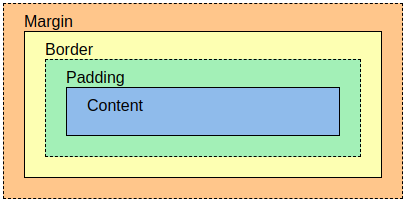

# Tugas 2

1. step 1 : membuat project django baru dilakukan dengan membuat direktori lokal dan mengaktifkan virtual environment
   step 2 : menjalankan python manage.py startapp main pada direktori utama untuk membuat app main
   step 3 : membuat file urls.py di main untuk mengatur routing URL di app main. Untuk routing proyek, tambahkan path('', include('main.urls')) di urls.py direktori utama bagian urlpatterns
   step 4 : mengisi models.py pada app main dengan class Product. Saya membuat 4 atribut yaitu name, price, description, dan image
   step 5 : mengisi views,py dengan data yang diinginkan sesuai model yang sudah dibuat. Kemudian membuat template html untuk isi konten app.
   step 6 : menambahkan  path('', show_product, name='show_product') di urls.py app main untuk mapping fungsi yang sudah dibuat di views.py
   step 7 : melakukan makemigration, migrate, kemudian git add, commit, push pws main:master
2. Berikut merupakan diagram request client ke platform django
      

3. 
      - Mengelola versi kode: Melacak setiap perubahan kode, agar masih bisa kembali ke versi sebelumnya.
      - Kolaborasi tim: Memungkinkan banyak pengembang bekerja secara bersamaan tanpa bentrok.
      - Branching: Bekerja pada fitur terpisah tanpa mempengaruhi kode utama.
      - Merging: Menggabungkan cabang terpisah kembali ke proyek utama.
      - Conflict handling: Menangani konflik saat dua orang mengubah bagian kode yang sama.
      - History: Menyimpan semua perubahan yang pernah dibuat.
      - Distribusi: Memungkinkan pekerjaan offline dengan salinan lengkap proyek.
      - Backup otomatis: Setiap salinan berfungsi sebagai cadangan proyek.

4. 
      - Menyediakan banyak fitur bawaan (seperti otentikasi, routing, ORM) yang mengurangi kebutuhan untuk memasang banyak library eksternal sehingga bisa langsung fokus pada logika
      aplikasi tanpa khawatir soal hal-hal teknis dasar.
      - Menerapkan arsitektur Model-View-Template (MVT) sehingga memudahkan pemahaman alur aplikasi dan pengembangan software yang terorganisir.

5. Model pada Django disebut ORM (Object-Relational Mapping) karena menghubungkan objek Python dengan tabel di database. Dengan ORM, developer bisa bekerja dengan data di database seperti bekerja dengan objek Python, tanpa perlu SQL sebagai database.

# Tugas 3

1. 
      - Optimalisasi Interaksi Antara Klien dan Server: Platform membutuhkan mekanisme yang efisien untuk pertukaran data antara klien (seperti browser atau aplikasi) dan server. Proses ini melibatkan pengiriman permintaan HTTP dan penerimaan respons HTTP, yang harus dijalankan dengan cepat dan tepat untuk mengurangi waktu tunggu dan meningkatkan kepuasan pengguna.

      - Pengelolaan Respons HTTP yang Efektif: Terdapat berbagai metode permintaan HTTP seperti GET, POST, PUT, PATCH, dan DELETE memainkan peran penting dalam CRUD (Create, Read, Update, Delete) operasi pada data. Platform perlu mengelola respons ini secara efisien untuk menjamin data yang diakses adalah akurat dan terkini, yang sangat penting dalam operasi seperti update konten dinamis atau transaksi e-commerce.

      - Penggunaan AJAX dan JSON untuk Komunikasi Asinkron: AJAX (Asynchronous JavaScript and XML) dan JSON (JavaScript Object Notation) memungkinkan penggunaan data secara asinkron, yang berarti pengguna dapat terus berinteraksi dengan halaman web sementara data lain sedang dimuat sehingga membantu meningkatkan responsivitas dan kecepatan platform, memungkinkan pengguna merasakan pengalaman yang lebih mulus tanpa harus menunggu halaman dimuat sepenuhnya.

2. 
      - Lebih Ringkas: JSON memiliki format yang lebih sederhana dan ukuran file yang lebih kecil dibandingkan XML.
      - Lebih Cepat: JSON lebih cepat diproses karena lebih ringan dan mudah di-parse oleh bahasa pemrograman seperti JavaScript.
      - Kompatibilitas: JSON secara alami kompatibel dengan banyak bahasa pemrograman modern, khususnya JavaScript.
      - Mudah Dibaca: JSON lebih mudah dibaca oleh manusia dan mesin karena sintaks yang sederhana.
      - Populer di API Modern: JSON lebih umum digunakan dalam AJAX dan RESTful APIs karena kecepatan dan efisiensinya.

3. Dalam Django, method is_valid() digunakan pada form untuk memeriksa apakah data yang diinput oleh pengguna sesuai dengan aturan validasi yang telah didefinisikan di dalam form tersebut. Fungsi ini sangat penting untuk memastikan bahwa hanya data yang valid yang akan diproses lebih lanjut, seperti disimpan dalam database.

      ```
      form = ProductEntryForm(request.POST or None)

      if form.is_valid() and request.method == "POST":
      form.save()  # Data valid disimpan ke database
      return redirect('main:show_main')
      ```

4. csrf_token dibutuhkan di Django untuk melindungi aplikasi dari serangan Cross-Site Request Forgery (CSRF). Token ini memastikan bahwa permintaan yang dikirim berasal dari sumber yang sah dan mencegah penyerang mengirim permintaan palsu atas nama pengguna.

      Tanpa csrf_token, aplikasi menjadi rentan terhadap serangan CSRF, di mana penyerang dapat memanfaatkan session pengguna yang valid untuk melakukan tindakan berbahaya seperti perubahan data atau transaksi tanpa sepengetahuan pengguna.

5. 
      - buat forms.py untuk input data:
            
            from django.forms import ModelForm
            from main.models import Product

            class ProductEntryForm(ModelForm):
            class Meta:
                  model = Product
                  fields = ["name", "price", "description"]
        
      - update views.py untuk form:
            
            from django.shortcuts import render, redirect
            from .forms import ProductEntryForm

            def create_product_entry(request):
            form = ProductEntryForm(request.POST or None)
            if form.is_valid() and request.method == 'POST':
                  form.save()
                  return redirect('main:show_main')
            return render(request, 'create_product_entry.html', {'form': form})

      - buat template form di create_product_entry.html
      - buat View untuk Format XML dan JSON

            from django.http import HttpResponse
            from django.core import serializers
            from .models import Product
                        
            def show_xml(request):
            data = Product.objects.all()

            def show_xml(request):
            data = Product.objects.all()
            return HttpResponse(serializers.serialize("xml", data), content_type="application/xml")

            def show_json(request):
            data = Product.objects.all()

            def show_json(request):
            data = Product.objects.all()
            return HttpResponse(serializers.serialize("json", data), content_type="application/json")

      - update routibg url :

            from django.urls import path
            from main.views import show_main
            from main.views import show_main, create_product_entry
            from main.views import show_main, create_product_entry, show_xml
            from main.views import show_main, create_product_entry, show_xml, show_json

            app_name = 'main'

            urlpatterns = [
            path('', show_main, name='show_main'),
            path('create-product-entry', create_product_entry, name='create_product_entry'),
            path('xml/', show_xml, name='show_xml'),
            path('json/', show_json, name='show_json'),
            ]

      
      

# Tugas 4
1. 
      | **Aspek**                   | **HttpResponseRedirect()**                        | **redirect()**                              |
      |-----------------------------|----------------------------------------------------|---------------------------------------------|
      | **Definisi**                | Kelas yang mengembalikan respons HTTP redirect (302) secara langsung. | Fungsi utilitas Django untuk membuat redirect dengan lebih mudah. |
      | **Penggunaan**              | Menerima URL string sebagai argumen.              | Menerima URL string, nama view, atau objek model sebagai argumen. |
      | **Fleksibilitas**           | Kurang fleksibel, hanya bekerja dengan URL string. | Lebih fleksibel, dapat bekerja dengan nama view dan objek model. |
      | **Contoh Penggunaan**       | `HttpResponseRedirect('/target-url/')`            | `redirect('target-view-name')` atau `redirect('/target-url/')` |
      | **Keterbacaan Kode**        | Kurang intuitif untuk pemula karena membutuhkan URL eksplisit. | Lebih mudah dipahami dan digunakan dalam konteks aplikasi Django. |
      | **Kemudahan Penentuan URL** | Harus menentukan URL secara manual.               | Otomatis menangani penentuan URL jika menggunakan nama view atau model. |
      | **Internal Mechanism**      | Mengembalikan objek `HttpResponseRedirect`.       | Merupakan pembungkus yang juga mengembalikan `HttpResponseRedirect` setelah memproses URL. |

2. Untuk menghubungkan model `Product` dengan `User`, kita menggunakan *ForeignKey* pada model `Product` yang mengacu ke model `User`. Sehingga memungkinkan setiap produk terkait dengan satu pengguna, dan satu pengguna dapat memiliki banyak produk.

      ### Implementasi:

      **Definisikan Relasi di Model:**

      ```python
      from django.db import models
      from django.contrib.auth.models import User

      class Product(models.Model):
            name = models.CharField(max_length=100)
            price = models.DecimalField(max_digits=10, decimal_places=2)
            description = models.TextField()
            owner = models.ForeignKey(User, on_delete=models.CASCADE)  # Menghubungkan ke User
      ```

      **Penjelasan:**

      - **`ForeignKey`**: Menunjukkan bahwa `Product` terhubung dengan `User`.
      - **`on_delete=models.CASCADE`**: Jika pengguna dihapus, produk yang dimiliki juga dihapus.

      **Penggunaan di Views:**

      Saat membuat produk, kita bisa menetapkan `owner` sebagai pengguna yang sedang login:

      ```python
      def create_product(request):
            form = ProductEntryForm(request.POST or None)
            if form.is_valid():
            product = form.save(commit=False)
            product.owner = request.user
            product.save()
            return redirect('main:show_main')
      ```

      **Mengakses Data:**

      Kita bisa mendapatkan semua produk milik pengguna dengan:

      ```python
      user_products = request.user.product_set.all()
      ```
3.
      **Authentication**: Proses memverifikasi identitas pengguna, yaitu memastikan siapa pengguna tersebut. Contoh umumnya adalah saat pengguna memasukkan username dan password untuk login.
      
      **Authorization**: Proses memverifikasi apakah pengguna yang sudah diotentikasi memiliki izin untuk mengakses sumber daya tertentu. Ini menentukan apa yang dapat atau tidak dapat dilakukan oleh pengguna di dalam aplikasi.

      ### Apa yang Dilakukan saat Pengguna Login

      Saat pengguna login, yang terjadi adalah **authentication**—sistem memeriksa kredensial (seperti username dan password) untuk memastikan pengguna adalah siapa yang mereka klaim. Jika berhasil, pengguna diotentikasi dan session untuk pengguna tersebut dimulai.

      ### Implementasi di Django

      1. **Authentication di Django**:
      - Django menggunakan middleware otentikasi bawaan (`django.contrib.auth`) yang menyediakan fungsi login, logout, dan sistem manajemen pengguna.
      - Metode `authenticate()` memverifikasi kredensial pengguna, dan `login()` digunakan untuk memulai session pengguna.

      ```python
      from django.contrib.auth import authenticate, login

      def user_login(request):
            username = request.POST['username']
            password = request.POST['password']
            user = authenticate(request, username=username, password=password)
            if user is not None:
            login(request, user)
            # Pengguna berhasil diotentikasi
            else:
            # Autentikasi gagal
      ```

      2. **Authorization di Django**:
      - Django mengatur izin dengan menggunakan model `Permissions` dan grup yang dapat diberikan kepada pengguna.
      - Menggunakan dekorator seperti `@login_required` dan `@permission_required` untuk mengontrol akses ke fungsi atau halaman tertentu.

      ```python
      from django.contrib.auth.decorators import login_required, permission_required

      @login_required
      @permission_required('app_name.permission_name')
      def view_protected(request):
            # Hanya pengguna yang diotentikasi dan diizinkan yang dapat mengakses
      ```
4. Django mengingat pengguna login menggunakan **cookies** dan **session**. Saat login, Django menyimpan session ID di server dan mengirimkan cookie berisi session ID ke browser pengguna. Saat pengguna mengakses situs kembali, cookie ini membantu Django mengenali pengguna.

      ### Kegunaan Lain dari Cookies

      - **Menyimpan Preferensi Pengguna**: Misalnya, bahasa atau tema yang dipilih.
      - **Pelacakan dan Analitik**: Untuk memantau aktivitas pengguna di situs.
      - **Menyimpan Keranjang Belanja**: Menyimpan item dalam keranjang belanja pengguna.
      - **Iklan dan Pemasaran**: Menampilkan iklan berdasarkan perilaku pengguna.

      ### Cookies bisa beresiko jika...

      - **Berisi Data Sensitif**: Rentan terhadap eksploitasi jika tidak dienkripsi.
      - **Tidak Aman (HTTP Only)**: Bisa diakses oleh JavaScript, rentan terhadap XSS.
      - **Tidak Menggunakan Secure Flag**: Rentan disadap saat dikirim tanpa enkripsi.
      - **CSRF**: Bisa dieksploitasi dalam serangan Cross-Site Request Forgery jika tidak dilindungi dengan baik.

5. 
      ### 1. Mengimplementasikan Fungsi Registrasi, Login, dan Logout

      - **Langkah 1: Implementasi Registrasi**
      - Buat fungsi `register` di `views.py` menggunakan `UserCreationForm` untuk menangani pendaftaran pengguna baru.
      - Pada form, validasi input dan simpan data jika valid, lalu arahkan pengguna ke halaman login.

      ```python
      from django.contrib.auth.forms import UserCreationForm
      from django.contrib import messages
      from django.shortcuts import render, redirect

      def register(request):
            form = UserCreationForm()
            if request.method == "POST":
                  form = UserCreationForm(request.POST)
                  if form.is_valid():
                  form.save()
                  messages.success(request, 'Your account has been successfully created!')
                  return redirect('main:login')
            context = {'form': form}
            return render(request, 'register.html', context)
      ```

      - **Langkah 2: Implementasi Login**
      - Buat fungsi `login_user` di `views.py` menggunakan `AuthenticationForm` untuk memvalidasi login pengguna.
      - Jika valid, lakukan login dan simpan waktu login terakhir ke dalam cookie.

      ```python
      from django.contrib.auth import authenticate, login
      from django.http import HttpResponseRedirect
      from django.urls import reverse
      import datetime

      def login_user(request):
            if request.method == 'POST':
                  form = AuthenticationForm(data=request.POST)
                  if form.is_valid():
                  user = form.get_user()
                  login(request, user)
                  response = HttpResponseRedirect(reverse("main:show_main"))
                  response.set_cookie('last_login', str(datetime.datetime.now()))
                  return response
            else:
                  form = AuthenticationForm()
            return render(request, 'login.html', {'form': form})
      ```

      - **Langkah 3: Implementasi Logout**
      - Buat fungsi `logout_user` untuk menangani logout pengguna dan hapus cookie `last_login`.

      ```python
      from django.contrib.auth import logout

      def logout_user(request):
            logout(request)
            response = HttpResponseRedirect(reverse('main:login'))
            response.delete_cookie('last_login')
            return response
      ```

      ### 2. Membuat Dua Akun Pengguna dengan Dummy Data

      - **Langkah 4: Membuat Akun dan Dummy Data**
      - Buat dua akun pengguna menggunakan form registrasi di aplikasi. 
      - Login dengan setiap akun dan tambahkan tiga data dummy untuk model `Product` yang telah dibuat sebelumnya.

      ### 3. Menghubungkan Model Product dengan User

      - **Langkah 5: Tambahkan ForeignKey di Model Product**
      - Tambahkan relasi ForeignKey dari model `Product` ke model `User` untuk menghubungkan produk dengan pemiliknya.

      ```python
      from django.contrib.auth.models import User

      class Product(models.Model):
            name = models.CharField(max_length=100)
            price = models.DecimalField(max_digits=10, decimal_places=2)
            description = models.TextField()
            owner = models.ForeignKey(User, on_delete=models.CASCADE)
      ```

      - **Langkah 6: Modifikasi View untuk Menyimpan Data**
      - Saat membuat produk baru, pastikan bahwa produk dihubungkan dengan pengguna yang sedang login.

      ```python
      def create_product_entry(request):
            form = ProductEntryForm(request.POST or None)
            if form.is_valid() and request.method == "POST":
                  product = form.save(commit=False)
                  product.owner = request.user
                  product.save()
                  return redirect('main:show_main')
            return render(request, "create_product_entry.html", {'form': form})
      ```

      ### 4. Menampilkan Detail Pengguna yang Logged In dan Menggunakan Cookies

      - **Langkah 7: Menampilkan Informasi Pengguna yang Login**
      - Di view utama (`show_main`), tambahkan informasi username dan last login dari cookie untuk ditampilkan.

      ```python
      def show_main(request):
            context = {
                  'username': request.user.username,
                  'last_login': request.COOKIES.get('last_login', 'N/A'),
            }
            return render(request, 'main.html', context)
      ```

      - **Langkah 8: Modifikasi Template untuk Menampilkan Last Login**
      - Di halaman utama (`main.html`), tambahkan kode untuk menampilkan username dan waktu last login pengguna.

      ```html
      <h4>Welcome, {{ username }}</h4>
      <h5>Last login: {{ last_login }}</h5>
      ```
                              
# Tugas 5

1. ### Urutan Prioritas CSS Selector
      **Inline CSS** (`style=""`)
      - Gaya yang ditulis langsung di elemen HTML menggunakan atribut `style=""` memiliki prioritas tertinggi.
      - Contoh:
      ```html
      <p style="color: red;">Teks ini akan berwarna merah.</p>
      ```
      **ID Selector** (`#id`)
      - Selector berbasis ID memiliki prioritas tinggi. Ditandai dengan tanda `#` diikuti nama ID.
      - Contoh:
      ```css
      #header {
            color: blue;
      }
      ```

      **Class, Pseudo-Class, dan Attribute Selector** (`.class`, `:hover`, `[type="text"]`)
      - Selector class, pseudo-class, dan attribute memiliki tingkat spesifisitas yang sama. Prioritasnya lebih rendah dari ID tetapi lebih tinggi dibandingkan selector elemen/tag.
      - Contoh:
      ```css
      .header {
            color: green;
      }
      
      a:hover {
            color: yellow;
      }

      [type="text"] {
            color: red;
      }
      ```

      **Element/Tag Selector** (`h1`, `p`, `div`)
      - Selector elemen/tag memiliki spesifisitas yang lebih rendah dibandingkan selector class atau ID.
      - Contoh:
      ```css
      p {
            color: black;
      }
      ```

      **Universal Selector** (`*`)
      - Selector universal (`*`) diterapkan ke semua elemen, namun spesifisitasnya paling rendah.
      - Contoh:
      ```css
      * {
            margin: 0;
            padding: 0;
      }
      ```

      **Aturan `!important`**
      - Aturan `!important` akan mengabaikan spesifisitas dan memaksa penerapan gaya tersebut.
      - Contoh:
      ```css
      p {
            color: blue !important;
      }
      ```

      ### Urutan Spesifisitas CSS

      1. **Inline styles**: Prioritas tertinggi.
      2. **ID selectors**: Lebih spesifik dari class dan tag.
      3. **Class, pseudo-class, dan attribute selectors**: Lebih spesifik dari tag selector.
      4. **Element/Tag selectors**: Spesifisitas paling rendah.
      5. **`!important`**: Memaksa penerapan gaya, mengesampingkan prioritas lainnya.

      ### Contoh Spesifisitas

      ```html
      <!DOCTYPE html>
      <html>
      <head>
      <style>
      p { color: green; }          /* Specificity: 0,0,0,1 */
      .highlight { color: yellow; } /* Specificity: 0,0,1,0 */
      #important { color: blue; }   /* Specificity: 0,1,0,0 */
      p#important { color: red; }   /* Specificity: 0,1,0,1 */
      </style>
      </head>
      <body>
      <p id="important" class="highlight">Hello World!</p>
      </body>
      </html>

2. ### Mengapa Responsive Design Penting dalam Pengembangan Aplikasi Web?

      **Responsive design** adalah pendekatan desain web yang memastikan tampilan dan fungsionalitas aplikasi web dapat beradaptasi dengan berbagai ukuran layar dan perangkat, seperti smartphone, tablet, dan desktop. Berikut adalah beberapa alasan mengapa responsive design sangat penting:

      **Pengalaman Pengguna (User Experience) yang Optimal**:
      - Pengguna dapat mengakses aplikasi web dengan nyaman dari perangkat apa pun, tanpa perlu zoom in atau scroll secara horizontal. Desain yang responsif memastikan konten dan elemen UI menyesuaikan dengan ukuran layar pengguna, meningkatkan pengalaman pengguna secara keseluruhan.

      **Peningkatan Aksesibilitas**:
      - Banyak pengguna mengakses internet dari perangkat mobile. Dengan responsive design, aplikasi web menjadi lebih mudah diakses oleh berbagai jenis perangkat, membuat informasi dapat diakses kapan saja dan di mana saja.

      **SEO yang Lebih Baik**:
      - Google dan mesin pencari lainnya memberikan peringkat lebih tinggi kepada situs web yang responsif. Desain yang responsif membantu meningkatkan peringkat SEO, karena Google menggunakan mobile-first indexing, yang berarti situs web yang ramah mobile akan mendapat peringkat lebih baik.

      **Efisiensi Pengembangan dan Pemeliharaan**:
      - Menggunakan responsive design memungkinkan pengembang untuk membuat satu versi situs web yang bekerja di berbagai perangkat, dibandingkan harus membuat versi terpisah untuk desktop dan mobile. Ini membuat pemeliharaan lebih mudah dan lebih efisien.

      **Kompatibilitas Perangkat yang Beragam**:
      - Dengan beragam perangkat yang digunakan oleh pengguna, dari smartphone hingga monitor besar, responsive design memungkinkan aplikasi web untuk tampil optimal di semua resolusi layar.

      ### Contoh Aplikasi yang Menerapkan dan Tidak Menerapkan Responsive Design

      #### Aplikasi yang Sudah Menerapkan Responsive Design:

      **Airbnb** (https://www.airbnb.com):
      - Airbnb menyesuaikan tata letak, ukuran teks, dan navigasi berdasarkan ukuran layar. Pada perangkat mobile, menu navigasi dikompresi menjadi ikon hamburger, sementara pada desktop, navigasi ditampilkan lengkap.

      **Amazon** (https://www.amazon.com):
      - Amazon menggunakan responsive design untuk menampilkan produk dengan baik di perangkat apa pun. Pada mobile, tata letak produk dipadatkan menjadi satu kolom, sementara pada desktop, produk ditampilkan dalam grid.

      #### Aplikasi yang Belum Menerapkan Responsive Design:

      **Situs Web Kuno**:
      - Beberapa situs web lama yang belum diperbarui mungkin tidak menerapkan responsive design. Situs-situs ini mungkin memerlukan zoom atau scroll horizontal saat dibuka di perangkat mobile, yang membuat pengalaman pengguna kurang nyaman.

      **Situs Web Statis**:
      - Situs web statis atau situs yang dibangun tanpa memperhatikan variasi ukuran layar sering kali tidak responsif, sehingga terlihat tidak rapi atau susah diakses dari perangkat mobile.

3. ### Perbedaan antara Margin, Border, dan Padding

   - **Margin** adalah ruang di luar elemen, yang digunakan untuk memberikan jarak antara elemen tersebut dengan elemen lain di sekitarnya.
   - **Fungsi**: Margin berfungsi untuk mengatur spasi luar antara elemen, misalnya jarak antara dua div atau elemen HTML lainnya.
   - **Implementasi**: Anda dapat menggunakan properti `margin`, `margin-top`, `margin-right`, `margin-bottom`, dan `margin-left` untuk mengatur margin di sisi tertentu.
   - **Contoh**:
     ```css
     .box {
         margin: 20px; /* Memberikan margin 20px di semua sisi */
     }

     .box-top {
         margin-top: 10px; /* Memberikan margin 10px hanya di atas */
     }
     ```

   - **Border** adalah garis yang mengelilingi elemen, berada di antara padding dan margin. Border bisa diatur dengan ketebalan, warna, dan gaya (solid, dashed, dotted, dll.).
   - **Fungsi**: Border berfungsi sebagai batas visual di sekitar elemen.
   - **Implementasi**: Border diatur menggunakan properti `border`, `border-width`, `border-color`, `border-style`, atau kombinasi dari ketiganya.
   - **Contoh**:
     ```css
     .box {
         border: 2px solid black; /* Border hitam solid dengan ketebalan 2px */
     }

     .box-dashed {
         border: 1px dashed red; /* Border merah bergaris putus-putus dengan ketebalan 1px */
     }
     ```

   - **Padding** adalah ruang di dalam elemen, yaitu jarak antara konten elemen dengan batas (border) elemen tersebut.
   - **Fungsi**: Padding berfungsi untuk memberikan jarak antara konten dan batas elemen, membuat konten tidak terlalu mepet dengan tepi elemen.
   - **Implementasi**: Anda dapat menggunakan properti `padding`, `padding-top`, `padding-right`, `padding-bottom`, dan `padding-left` untuk mengatur padding di sisi tertentu.

   - **Contoh**:
     ```css
     .box {
         padding: 15px; /* Memberikan padding 15px di semua sisi */
     }

     .box-left {
         padding-left: 20px; /* Memberikan padding 20px hanya di sebelah kiri */
     }
     ```

      ### Visualisasi Margin, Border, dan Padding

      


      ### Contoh Penggunaan Margin, Border, dan Padding Secara Bersamaan
      ```css
      .box {
            margin: 20px;         /* Jarak elemen dengan elemen lain di luar*/
            padding: 10px;        /* Jarak antara konten dan border elemen */
            border: 2px solid black;  /* Border hitam dengan ketebalan 2px */
      }
      ```

4. ### Konsep Flexbox dan Kegunaannya

      **Flexbox** adalah modul tata letak di CSS yang dirancang untuk merancang layout satu dimensi, yaitu mengatur elemen dalam satu baris (row) atau satu kolom (column). Flexbox memungkinkan pengembang mengatur distribusi ruang antara elemen, menyelaraskan elemen, dan membuat elemen fleksibel sesuai dengan ukuran kontainer atau elemen lain dalam satu dimensi.

      #### Kegunaan Flexbox:
      1. **Penataan Satu Dimensi**: Flexbox digunakan untuk menata elemen secara horisontal (baris) atau vertikal (kolom).
      2. **Responsif**: Elemen dapat diperluas atau dikompresi agar sesuai dengan ukuran kontainer induk, sehingga sangat berguna untuk tata letak responsif.
      3. **Menyelaraskan Elemen**: Flexbox menyediakan kontrol yang kuat untuk menyelaraskan elemen di sepanjang kedua sumbu (horizontal dan vertikal).
      4. **Distribusi Spasi**: Flexbox dapat mendistribusikan ruang antara elemen secara merata, baik dalam arah horisontal maupun vertikal.

      #### Properti Utama Flexbox:
      - `display: flex;`: Mengaktifkan flexbox pada elemen kontainer.
      - `flex-direction`: Menentukan arah tata letak (row, column).
      - `justify-content`: Mengatur penyelarasan elemen di sepanjang sumbu utama (horizontal atau vertikal).
      - `align-items`: Mengatur penyelarasan elemen di sepanjang sumbu yang berlawanan (misalnya, menyelaraskan elemen secara vertikal ketika tata letak adalah `row`).
      - `flex-wrap`: Menentukan apakah elemen dalam kontainer dapat dibungkus ke baris atau kolom berikutnya jika ruang tidak cukup.

      #### Contoh Flexbox:
      ```css
      .container {
            display: flex;
            justify-content: space-between;  /* Elemen didistribusikan secara merata */
            align-items: center;             /* Elemen diselaraskan di tengah vertikal */
      }
      ```

      ### Konsep Grid Layout dan Kegunaannya

      **Grid Layout** adalah modul CSS yang memungkinkan pengaturan layout dua dimensi (baris dan kolom). Dengan grid, pengembang dapat membuat tata letak yang lebih kompleks dan terstruktur, mengatur elemen dalam baris dan kolom secara simultan. Grid memberikan kontrol penuh atas tata letak dalam kedua sumbu.

      #### Kegunaan Grid Layout:
      1. **Penataan Dua Dimensi**: Grid Layout digunakan untuk menata elemen dalam baris dan kolom secara bersamaan.
      2. **Tata Letak yang Kompleks**: Sangat cocok untuk tata letak halaman yang kompleks dengan banyak elemen seperti galeri foto, dashboard, atau halaman web dengan struktur grid yang jelas.
      3. **Responsif**: Grid memungkinkan elemen beradaptasi dengan ukuran layar yang berbeda, membuatnya ideal untuk desain responsif.
      4. **Kontrol Ukuran dan Spasi**: Grid memudahkan pengaturan ukuran elemen di dalam grid, seperti membentangkan elemen di beberapa baris atau kolom.

      #### Properti Utama Grid:
      - `display: grid;`: Mengaktifkan grid pada elemen kontainer.
      - `grid-template-columns` dan `grid-template-rows`: Menentukan jumlah dan ukuran kolom serta baris pada grid.
      - `grid-gap`: Menentukan jarak antara baris dan kolom di dalam grid.
      - `grid-column` dan `grid-row`: Menentukan berapa banyak kolom atau baris yang ditempati oleh elemen tertentu.

      #### Contoh Grid Layout:
      ```css
      .container {
            display: grid;
            grid-template-columns: repeat(3, 1fr); /* Membagi grid menjadi 3 kolom dengan ukuran yang sama */
            grid-gap: 20px;                        /* Jarak antara elemen grid */
      }
      ```

      ### Perbedaan Flexbox dan Grid Layout

      | **Flexbox**                              | **Grid Layout**                              |
      |------------------------------------------|---------------------------------------------|
      | Penataan **satu dimensi** (baris atau kolom) | Penataan **dua dimensi** (baris dan kolom)   |
      | Cocok untuk tata letak sederhana          | Cocok untuk tata letak yang lebih kompleks   |
      | Kontrol lebih pada distribusi dan penyelarasan | Kontrol lebih pada struktur tata letak       |
      | Elemen disusun secara fleksibel           | Elemen ditempatkan di dalam baris dan kolom yang didefinisikan |

5.
      ## Implementasikan Fungsi untuk Menghapus dan Mengedit Produk
      **Edit Produk**:
      - Tambahkan fungsi `edit_product` di `views.py`.
      Gunakan ProductForm sebagai instance untuk produk yang akan diubah.
      Pada form, jika validasi berhasil, lakukan save() dan redirect kembali ke halaman utama.
      - Tambahkan URL di urls.py untuk mengakses halaman edit.
      Buat template HTML edit_product.html yang menampilkan form untuk produk yang ingin diedit.
      ```python
      def edit_product(request, id):
      product = Product.objects.get(pk=id)
      form = ProductForm(request.POST or None, instance=product)
      if form.is_valid() and request.method == 'POST':
            form.save()
            return HttpResponseRedirect(reverse('main:show_main'))
      return render(request, 'edit_product.html', {'form': form})
      ```
      ***Hapus Produk***:
      Tambahkan fungsi delete_product di views.py untuk menghapus produk berdasarkan ID-nya.
      Setelah produk dihapus, lakukan redirect ke halaman utama.
      ```python
      def delete_product(request, id):
      product = Product.objects.get(pk=id)
      product.delete()
      return HttpResponseRedirect(reverse('main:show_main'))
      ```
      ### Kustomisasi Desain menggunakan Tailwind CSS
      ***Setup Tailwind CSS***:
      Pastikan sudah menambahkan CDN Tailwind di base.html.
      Tambahkan tag meta viewport untuk memastikan halaman responsif:
      ```html
      <meta name="viewport" content="width=device-width, initial-scale=1">
      <script src="https://cdn.tailwindcss.com"></script>
      ```
      ### Kustomisasi Halaman Login, Register, dan Tambah Produk
      ***Login Page***:
      Gunakan komponen Tailwind untuk membuat halaman login menarik dan responsif.
      Contoh kode:
      ```html
      <form method="POST" class="space-y-6">
      
      <div>
            <label for="username" class="block text-sm font-medium text-gray-700">Username</label>
            <input type="text" id="username" name="username" class="w-full px-3 py-2 border rounded">
      </div>
      <div>
            <label for="password" class="block text-sm font-medium text-gray-700">Password</label>
            <input type="password" id="password" name="password" class="w-full px-3 py-2 border rounded">
      </div>
      <button type="submit" class="bg-black text-white py-2 w-full rounded">Login</button>
      </form>
      ```
      ***Register Page***:
      Desain halaman register dengan menggunakan Tailwind. Gunakan struktur yang mirip dengan halaman login.

      ***Tambah Produk***:
      Halaman tambah produk harus menarik dan responsif. Tambahkan form untuk mengunggah gambar produk:
      ```html
      <form method="POST" enctype="multipart/form-data" class="p-8 bg-gray-800 text-white rounded-lg">
      
      <div class="mb-4">
            <label for="name">Product Name</label>
            <input type="text" name="name" class="w-full px-3 py-2 rounded">
      </div>
      <div class="mb-4">
            <label for="price">Price</label>
            <input type="number" name="price" class="w-full px-3 py-2 rounded">
      </div>
      <div class="mb-4">
            <label for="image">Upload Image</label>
            <input type="file" name="image" class="w-full px-3 py-2 rounded">
      </div>
      <button type="submit" class="bg-pink-500 py-2 w-full rounded">Add Product</button>
      </form>
      ```

      ### Kustomisasi Halaman Daftar Produk
      Jika belum ada produk:
      Tampilkan gambar placeholder dan pesan bahwa belum ada produk yang terdaftar.
      ```html
      
      <div class="text-center">
      
      <p>Belum ada produk yang terdaftar.</p>
      </div>
      
      ```
      Jika ada produk:
      Gunakan grid layout untuk menampilkan produk dalam bentuk card.
      Setiap card memiliki tombol untuk mengedit dan menghapus produk.
      ```html
      <div class="grid grid-cols-1 md:grid-cols-2 lg:grid-cols-4 gap-4">
      
      <div class="bg-gray-800 text-white p-4 rounded-lg shadow-lg">
            
            <h3 class="mt-4">{{ product.name }}</h3>
            <p>Rp {{ product.price }}</p>
            <div class="flex justify-between mt-4">
                  <a href="" class="bg-blue-500 text-white px-4 py-2 rounded">Edit</a>
                  <a href="" class="bg-red-500 text-white px-4 py-2 rounded">Delete</a>
            </div>
      </div>
      
      </div>
      ```
      ### Responsive Navbar
      Tambahkan navbar di semua halaman, yang berisi link ke halaman utama, tambah produk, dan basket.
      Navbar harus responsif dan bekerja pada perangkat mobile dan desktop.
      ```html
      <nav class="bg-gray-900 py-4 fixed top-0 w-full">
            <div class="container mx-auto flex justify-between items-center">
                  <a href="" class="text-white">Home</a>
                  <a href="" class="text-white">Add New Product<a>                  
                  <a href="" class="text-white">Go to Basket</a>
                  <a href="" class="text-white">Logout</a>
            </div>
      </nav>
      ```


